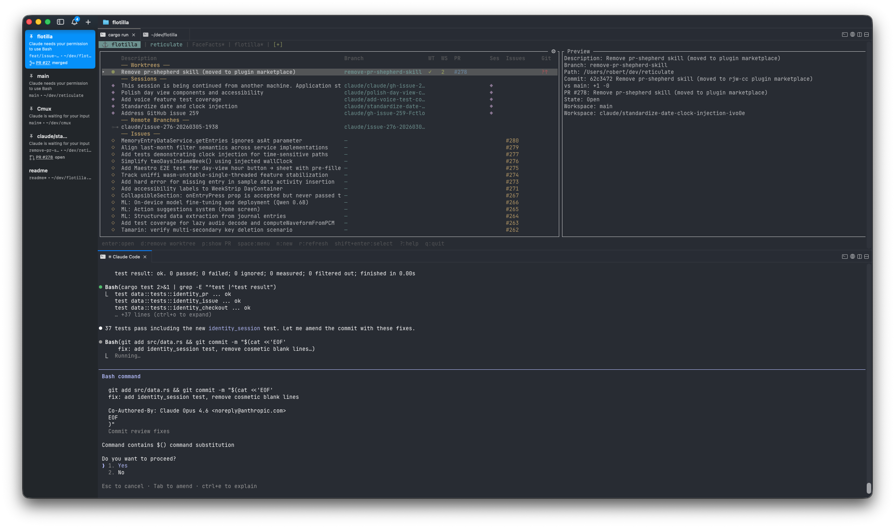

# flotilla

Development fleet management. Agents, branches, PRs, and workspaces across every repo in one view.




Each row correlates a branch with its PR, agent sessions, and workspace automatically.

## Providers

Flotilla uses a provider-based architecture. Available tools are auto-detected from your environment, with configurable overrides.

| Category | Focus | WIP | Future |
|----------|-------|-----|--------|
| Version control | git | | jj |
| Checkouts | git worktrees, wt | | jj workspaces |
| Code review | GitHub PRs | | GitLab MRs |
| Issue tracking | GitHub Issues | | Linear, Jira |
| Coding agents | Claude Code sessions | | Codex, other LLMs |
| Workspaces | cmux | tmux, zellij | |
| AI utilities | Claude (branch naming) | | |

## How it works

- **Auto-discovery**: detects tools from your environment, with configurable overrides. Git repo, GitHub remote, Claude CLI, terminal multiplexer — whatever is available gets used.
- **Correlation**: items sharing a branch name, checkout path, or session reference merge into one work item. One row per unit of work.
- **Providers**: pluggable traits per category. Multiple providers of the same type can coexist (e.g. GitHub Issues alongside Linear).
- **Workspace templates**: `.flotilla/workspace.yaml` defines pane layouts. One keystroke creates a multi-agent workspace.
- **Multi-repo**: each repo is a tab with its own detected providers.

## Quickstart

```
cargo install flotilla
cd your-repo
flotilla
```

Repo root is auto-detected from the current directory. Multiple repos can be managed as tabs.

## Future direction

The TUI is the first interface. The intention is to add a web dashboard and multi-host coordination — your laptop, build servers, cloud VMs — so you can see what's running from anywhere. Further out: coordinating agents, not just monitoring them.

## Documentation

- [Keybindings](docs/keybindings.md)
- [Workspace templates](docs/workspace-templates.md)
- [Configuration](docs/configuration.md)
- [Architecture](docs/architecture/)

---

This project makes extensive use of generative AI — in its development, documentation, and artwork (including the splash image).
