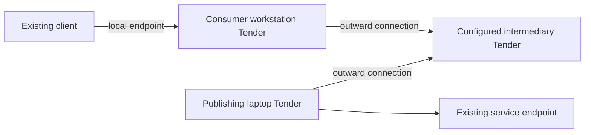

# Tender: provisional design and extraction assessment

Status: working design, not an accepted ADR or implementation specification.
Updated: 2026-09-11, from the September design conversation and local source inspection.

Planning is tracked in [Tender contract and extraction path](https://github.com/flotilla-org/flotilla/issues/1861).
The map settles the remaining contracts and exact initial implementation slices;
implementation follows it. Follow-up scope clarification recorded 2026-09-13:
preserve daemonless remote execution as described below.

Tender makes published service endpoints discoverable and connectable across
user accounts, machines, and containers. Consumers can obtain an opened byte
stream or a local forwarding endpoint. Applications keep their protocols and
their own object directories: cleat owns sessions, porthole owns presentation
and capture, and Flotilla owns resources and replication.

The first proof is publishing an existing endpoint and reaching it from an
existing client. Cleat changes are allowed to make it an ideal ordinary service
for Tender. “Unchanged” describes the resulting integration contract; it does
not freeze cleat's current implementation. Native Tender integration and a
combined directory of remote cleat sessions can follow separately.

## Working agreements

These are provisional agreements from the conversation. Larger installations
may require revisiting the deployment and access arrangements.

| Concern | Working agreement |
| --- | --- |
| Deployment | Per-user Tender instances. An always-on machine can use a dedicated service account. Machine location and Tender instance identity are distinct. |
| Bootstrap | Explicit SSH destinations initially; retain a seam for other transports and discovery sources. Finding a candidate does not establish trust. |
| Publication | Existing local endpoints can be published by configuration or a helper holding a registration. Applications need no Tender library dependency. |
| Containers | A helper may publish outward through a held connection using a narrow grant. A container need not become a fully trusted Tender instance. |
| Topology | Explicitly configured intermediaries can carry discovery and connections, including between outward-connected machines. Automatic arbitrary route discovery is unresolved. |
| Access | Publication permission is distinct from browse/connect permission. An explicit trusted group is the initial convenience policy. Publishers cannot widen their permitted audience. |
| Identity | Stable endpoint identity is separate from display name and current route. Reconnect preserves identity; replacement inherits it only through explicit assignment. |
| Failure | Disconnection marks a known publication unavailable. Existing streams fail; applications own protocol recovery. Withdrawal removes a publication, and expired or revoked grants prevent further use. |
| Client access | Opened streams and stable local forwarding endpoints. Unix sockets and Windows named pipes are local adapters. |

The older [Tender glossary](../../CONTEXT.md) and [ADR 0002](../adr/0002-multi-host-is-resource-store-federation.md)
describe a per-host daemon and HTTP-over-UDS control interface. This draft
refines deployment to per-user instances and local endpoints to include named
pipes. It does not silently supersede the ADR: control framing and identity
binding still need a decision before implementation.

## Model and responsibilities

A **Tender instance** is an independently configured identity operating with a
user account's authority. A friendly host alias selects an instance through a
configured route; it does not denote every user on the machine.

A **publication** associates an assigned endpoint identity, a service protocol
label, display metadata, an allowed audience, and a publisher. A publisher
holds a registration or is represented by local configuration. Protocol labels
are claims by the publisher, not proof that the endpoint implements them.
Clients still perform their application handshake. Jackstay also says
"publication" for a running frame stream with a local endpoint; a Jackstay
publication registered with Tender is one Tender publication whose protocol
label names the Jackstay setup channel, so the two uses nest rather than
collide. Frame transport itself is never carried by Tender (see the local IPC
paragraph below).

A **grant** authorises bounded publication, including identity scope and maximum
audience. Short-lived and reusable revocable grants should both fit the model.
The receiving Tender enforces the grant. A container publisher chooses a socket
within its environment; it receives no general right to ask the parent to open
arbitrary parent-account sockets or to browse other publications.

A **route** describes current reachability through live connections. It can
change without changing endpoint identity. Remembered publication metadata is
not evidence that a route is live. This preserves the distinction in
[ADR 0031](../adr/0031-plane-a-retires-rank-dies-with-polling.md).

A **local exposure** is a listener that connects clients to one publication.
Tender owns its listener, permissions, and cleanup. It never owns the published
application's session directories, process lifecycle, or source socket cleanup.

Flotilla may configure Tender and supply grants to provisioned environments.
Tender must also be usable from a human-operated command or script with no
Flotilla installation. Provisioning, waking machines, and starting application
daemons are separate operations; discovery must not trigger them.

## Interface sketch

### Compatibility: daemonless remote execution

A participating account may run both Tender and Flotilla, but ordinary remote
execution must not require either on the target. For an ephemeral cloud sandbox
or locked-down SSH account, local cleat can own a persistent terminal session
whose command is SSH to the target. This preserves the local session and history;
remote process survival after SSH loss depends on the target's setup.

Flotilla elsewhere owns orchestration for that target. Treat this as a
compatibility check on the extraction seam, not a new cloud-sandbox integration
deliverable. A configured SSH route to an existing endpoint also need not imply
a remote Tender; the map must settle how that route fits publication.

### Operations

This is a behavioural interface, not proposed Rust types or frozen wire syntax.

| Operation | Behaviour |
| --- | --- |
| Publish | Register an existing local endpoint under an authorised identity, either locally or through an outward publisher connection. |
| Browse/watch | Return permitted publications and subsequent availability, metadata, and withdrawal changes. Service contents remain opaque. |
| Connect | Resolve the endpoint, check access, and return an opened bidirectional stream or a classified error. |
| Expose locally | Maintain a local listener for an endpoint identity, independent of route changes. |
| Withdraw | End the publication explicitly. Connection loss alone is not withdrawal. |

Instance configuration, grant issuance/revocation, and diagnostics form the
management interface. They do not need to be known by an ordinary socket client.

The stream contract must cover ordered bytes, backpressure, closure, and
cancellation. Specify half-close semantics across platforms before freezing it.
Do not replay bytes across a broken stream or silently transfer an existing
stream onto a replacement publisher. Multiplexed implementations need bounded
buffers and cancellation so a stalled terminal cannot exhaust the shared link.

Local IPC features such as descriptor passing, peer process credentials,
shared-memory handles, and local filesystem paths do not become remote merely
because their containing socket is forwarded. Application authority remains
with the application; reaching porthole does not replace its own grants.

### Refinement: failure through an ordinary local listener

We agreed that attempts should fail promptly while unavailable. A listening
proxy can complete the client's local connect before it learns that the remote
open failed. Thus the portable guarantee is prompt connection failure **or
stream closure**, not necessarily an error from the client's connect syscall.
An explicit Tender connect request can return a structured error. Raw clients
can consult Tender diagnostics separately; Tender must not inject error text
into an arbitrary application's byte stream.

Stable local addresses are the target. Whether to unbind while unavailable,
how exposure requests survive a Tender restart, and retry deadlines remain
implementation decisions. No unavailable exposure may be rebound to a different
identity merely because its display name was reused.

## Three walkthroughs

### Existing cleat on an SSH host

1. The remote account runs cleat and Tender independently.
2. Configuration or a helper publishes cleat's existing endpoint.
3. The laptop Tender connects using its configured SSH destination and verifies
   the remote instance according to the identity policy still to be specified.
4. The laptop browses permitted publications and exposes the chosen endpoint
   locally. The client speaks cleat's protocol through it.
5. SSH loss breaks active streams and marks the route unavailable. Cleat keeps
   running remotely. A restored route permits fresh client connections.

An SSH jump host can be part of this transport without running Tender. Reuse
SSH's destination configuration rather than defining a second jump-host syntax.

### Container publisher through its host

1. A provisioner obtains a bounded publication grant from the receiving Tender.
2. It gives the grant to a helper inside the container, alongside cleat.
3. The helper opens an outward connection, registers the endpoint, and opens
   cleat connections locally when authorised incoming streams arrive.
4. A permitted laptop connects through the host Tender and that held connection.
5. Container disappearance makes the publication unavailable. Explicit teardown
   withdraws it or revokes its grant. Reuse of the identity requires assignment.

The helper need not implement a general Tender daemon. Grant delivery, transport
authentication, and reconnect ownership must be specified before this can run.

### Roaming laptop through an intermediary

Arrows show connection initiation, not the direction bytes can travel. The
intermediary advertises only permitted publications and carries authorised
streams between connected instances. No inbound dial to the laptop is required.

Open questions include how requester identity crosses the intermediary, whether
it is trusted with plaintext, and how remote grant revocation is enforced during
partitions. Trusted-group membership alone does not answer those questions.

## Assessment against local source

Inspected Flotilla at `0023ee0edccc5c23c3d84d7741add6edb56eee79`, cleat at
`dbeeca61148acf4dc13bf727c8e6ed54aa0aadbb`, and porthole at
`338fbecbfb4408451b4947f8b756aa9c6fdba4e5`. This was source inspection, not a
running forwarding experiment or Windows validation. Cleat had an existing
modification in `crates/cleat/tests/lifecycle.rs`, which was left untouched.
Sibling-repository links below assume the portfolio's usual checkout layout.

### Flotilla: useful mechanisms, domain-bound interface

| Source | Finding and extraction implication |
| --- | --- |
| [SSH transport](../../crates/flotilla-daemon/src/peer/ssh_transport.rs) | Holds SSH with both local and reverse socket forwarding, discovers the Flotilla socket, cleans stale forwards, and exchanges Flotilla hello/peer messages. Reuse the forwarding and cleanup experience; replace the service-specific discovery and handshake. |
| [Transport traits](../../crates/flotilla-daemon/src/peer/transport.rs) | `PeerSender` and `PeerTransport` expose `PeerWireMessage` and `NodeInfo`. They cannot be Tender's generic stream interface unchanged. |
| [Peer wire types](../../crates/flotilla-protocol/src/peer.rs) and [manager](../../crates/flotilla-daemon/src/peer/manager.rs) | Routing is mixed with commands, steps, host summaries, and response handling. Audit surviving callers; do not move this whole module into Tender. |
| [Replicator](../../crates/flotilla-daemon/src/server/replicator.rs) | `SocketPathSource` updates the forwarded path; generation checks protect against stale teardown. Flotilla can consume Tender reachability here, while keeping resource watches, cursors, and replication policy. |
| [Transport crate](../../crates/flotilla-transport/src/lib.rs) | Provides message and memory modules today. Its name does not establish that it is already the Tender extraction. |
| [Container hop resolver](../../crates/flotilla-core/src/hop_chain/environment.rs) | Supervises `docker exec` attachment and cleans child processes after disconnect. Publishing a stream can remove this need for some attachment paths; general command execution and provisioning remain outside Tender. |

The new work includes generic publication, grants, permitted discovery, endpoint
identity, local exposures, outward publishers, and configured intermediaries.
The existing SSH implementation proves forwarding mechanisms, not this whole
contract. Tender cannot be obtained by renaming a crate.

### Cleat: streams fit; local discovery also assumes ownership

[RuntimeLayout](../../../cleat/crates/cleat/src/runtime.rs) derives
`<root>/<daemon>/socket`, `daemon.pid`, and a `sessions` directory.
[SessionService::discover_daemons](../../../cleat/crates/cleat/src/server.rs)
finds daemon directories by requiring a `sessions` subdirectory. Thus directory
projection is plausible, but it is not yet an independent endpoint catalogue.

Other paths in `server.rs` inspect local session directories and registered PIDs.
`sweep_dead_daemon_sessions` removes session state, the socket, and PID file on
the dead-daemon path. `attach --no-create` also checks local session state.
[ensure_daemon_started](../../../cleat/crates/cleat/src/session.rs) combines a
socket probe with local process liveness and can unlink a socket and spawn a
daemon. A remote outage must never fall into those ownership paths. Fabricating
local PIDs is not a solution.

There is a more promising stream consumer already:
[provider_daemon.rs](../../../cleat/crates/cleat/src/provider_daemon.rs) connects
to the layout's socket and opens the packet protocol; its reader reconnects and
reopens session channels. That is application recovery which should stay in
cleat. It makes a stronger first experiment than trying to make every CLI
operation work through a fabricated runtime directory.

[Windows IPC](../../../cleat/crates/cleat/src/platform/ipc/windows.rs) creates
duplex byte-mode named pipes and writes the pipe name into a marker file at the
logical socket path. Clients read that marker. This supports the local-endpoint
direction, but the marker layout is a cleat convention, not Tender's universal
discovery format. Pipe permissions and closure behaviour still need platform
contract tests.

Candidate cleat preparation: separate endpoint selection from local daemon
ownership; obtain remote session directories through cleat's protocol; preserve
origin in metadata; keep remote failures away from local cleanup/start paths.
These changes should be useful without a Tender dependency. Whether an external
adapter can supply all discovery metadata remains unproven.

### Porthole: control and capture have different transport needs

[The README](../../../porthole/README.md) exposes HTTP-over-UDS operations.
[Agent authorization](../../../porthole/crates/portholed/src/routes/agent_guard.rs)
remains application-level authority. These are candidates for ordinary stream
forwarding, with application credentials preserved.

[capture_registry.rs](../../../porthole/crates/portholed/src/capture_registry.rs)
also has a separate file-descriptor listener. That is a concrete local IPC
facility to audit, not something generic byte forwarding can make remote.
Proving the control endpoint does not prove remote capture transport. Jackstay
and any cross-host content encoding remain separate design work.

## Decisions required before an implementation contract

1. Bind stable Tender identity to SSH authentication and later transports;
   define enrolment and identity replacement. Existing Flotilla node IDs must
   not silently become user-account or grant identities.
2. Specify grant representation, storage, delivery, expiry, revocation, and
   whether revocation terminates already-open streams. Define partition rules
   for intermediaries before claiming a revocation guarantee.
3. Choose intermediary trust and caller attribution. Bound forwarding paths
   and prevent loops even with explicit configuration.
4. Specify publication generations and simultaneous publisher claims, stale
   withdrawal rejection, retention of unavailable entries, and restart recovery.
5. Choose framing for publication/watch/open-stream control and transport
   multiplexing. Define byte budgets, backpressure, half-close, deadlines, and
   cancellation without imposing cleat or Flotilla message types.
6. Specify local exposure ownership, filesystem/pipe permissions, and diagnostics.
   State what ordinary clients can observe versus explicit Tender clients.

Future DNS-based discovery, alternative network transports, larger-installation
policy, and automatic topology can remain open. Their future existence should
not force current services to understand routes or Tender internals.

## Proposed proof and extraction sequence

Keep the coherent design in view while proving it in the workspace, following
the [roadmap](../roadmap.md). These are proposed slices, not filed tasks.

1. Define the stream/publication interface and its behaviour contracts using
   in-memory adapters. Exercise all three walkthroughs, authorisation denial,
   grant loss, stale teardown, duplicate claims, and reconnect without byte replay.
2. Publish an existing cleat endpoint over SSH and consume its packet directory
   and a session through a local exposure. Verify that interruption leaves cleat
   running and recovery belongs to its client. Record which client paths work.
3. Prove outward container publication and the explicit intermediary with the
   same generic contract. Give a container only its bounded grant. Do not defer
   these cases until after choosing a wire model that cannot support them.
4. Make Flotilla consume the interface for resource endpoints. Audit and replace
   surviving domain-specific peer routing separately before deleting it. Preserve
   the roadmap's rule against growing legacy peer-merge.
5. Exercise a second application's ordinary endpoint, then Unix/Windows local
   adapter contracts. Separate cleat preparation from Tender-specific glue.
   Promote to a standalone repository only after the consumers prove the seam.

Most logic should use injected collaborators and in-memory contract tests.
Real SSH/socket/pipe checks establish the adapter behaviour those tests cannot
prove. No implementation tests were run for this documentation change.
